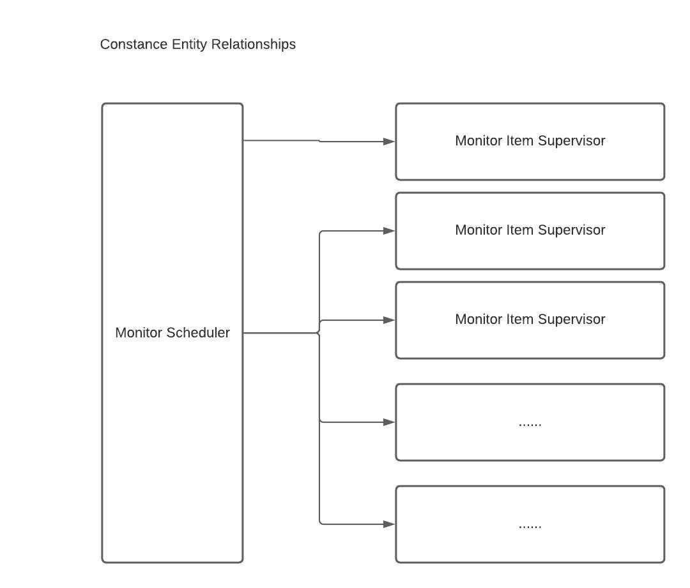

# Monitor GenServer's

In Constance we have this notion of a Monitor. A monitor represents the url being checked by the system.
A monitor also has a monitor name such as Github.com web svc that represents the monitor item.

To solve our speed issue, we wanted something that would provide concurrency. To ensure that an error
checking one url would be properly handled and not prevent the rest of the monitor items from being checked,
we wanted something fault tolerant.

By leveraging Dynamic Supervisors and GenServers we can concurrently "check" thousand of urls or other
types of monitor items such as traceroutes, database connectivity check and other types of monitor items.
We gracefully handle any errors that might occur for a given http check and track each http check process
to be reported on later.

Why did we choose to have a dynamic supervisor over a GenServer that isn't dynamic?
If a Monitor Item that is being checked somehow crashes the GenServer and we are running monitor checks then
our network monitoring is compromised. A dynamic supervisor will work by starting up a separate monitor item
GenServer for each monitor item.

# Monitor Scheduler

This GenServer will send a message to itself every n minutes to schedule itself to do some work. The
work that it will be scheduling is to call the Monitor Initiator. The scheduler interval is configured
in a Setting called scheduler_interval that stores the time in minutes. The Monitor Scheduler has a fail
safe that will enable or disable the Constance network monitoring system through a setting called
"all_notifications_enabled" where setting this to a string value of "false" will disable Constance
network monitoring system and a string value of "true" will enable Constance network monitoring system.

This GenServer has a supervision strategy that will restart it in the event of a crash as we always want
the Monitor Scheduler to be running.

# Monitor Initiator

Monitor Initiator is a helper library to start the Monitor Item Supervisor. This library will get a
list of monitors in the system (not paused monitors) and it will start a Monitor Item Supervisor
for each Monitor Item. If there are 12 monitors in the system then there will be 12 Dynamic Monitor Item
Supervisors.

# Monitor Item Supervisor

A Dynamic Supervisor that will spin up Monitor Item Worker GenServer in order to enact the monitor item
check process.

# Monitor Item Worker

A GenServer that handles calling the monitor library that checks whether a website is "up" or "down" and
then triggers a notification in the event a monitor item is down. Monitor Item checks are encapsulated in
a library Http.Check.Core that handle the details of calling out and doing an http check for a url.

This GenServer has a restart set to Temporary so that if they crash while doing a monitor check
then they aren't restarted. This is a potential bug and is a future consideration. For now an http check
just succeeds but when there are other more complicated checks such as ping, traceroute, database checks then

When this GenServer starts up it is hydrated with state that contains the monitor url and monitor name.
The GenServer sends itself a message for :check_item that is handled in `handle_info(:check_item, state)` method signature.
In `handle_info` a call is done to the Http.Check.Core library method `process_by_url` passing in the url to
check for the monitor item. Upon the pattern match for :ok atom a success message is sent to itself via
`GenServer.cast(self(), {:success})`. When the pattern match for :error atom occurs then a failure message
is sent to itself via `GenServer.cast(self(), {:failure})`. When a failure message occurs then Notifications are
sent via Notifier library. See Notifier library for details of SendGrid and Slack Notifications.
When the method signature for `handle_cast({:failure}, state)` is met then the Notifier library is called passing
in the Monitor name and a "down" message. Currently we don't track success for Monitor in the system where this
is a feature enhancement to store success checks for the current day, week for each scheduler
interval and then to rollup and aggregate the data in rollup history tables for history data older than 2 weeks.

# Http Check Core Library

Http.Check.Core is developed as functional core that provides separation of concerns to only focus on checking if a
url is up or down using the HTTPoison library. This is the meat and potatoes where the real work is done to check if
a url is up or down.

Usage:

- Call a url `Http.Check.Core.process_by_url "http://www.test.com"` and upon success an :ok atom is returned when
  HTTPoison gets a 301 or 200 HTTP response code for a url. Another HTTP response code will return an :error atom

# Notify

Notify is developed as functional core that provides separation of concerns to only focus on sending configured
Slack or email SendGrid notifications. If Slack notifications are configured via Settings table then they will be
sent. If email SendGrid notifications are configured via Settings table then they will be sent. If notifications
are not confifgured then you can see notification via standard output when you run Constance.

Usage:

- Call Notify.Core.send_notification "Github.com http svc", "up"
- Call Notify.Core.send_notification "Github.com http svc", "down"
